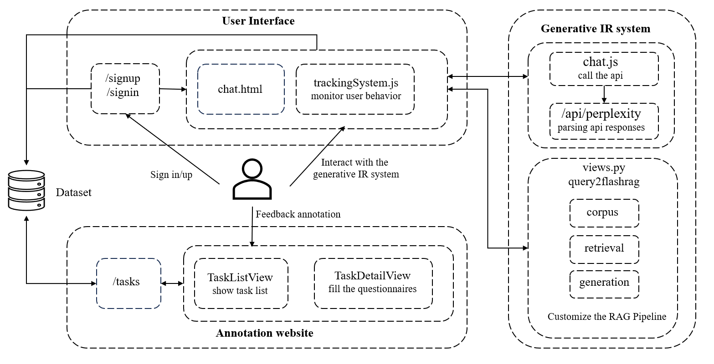
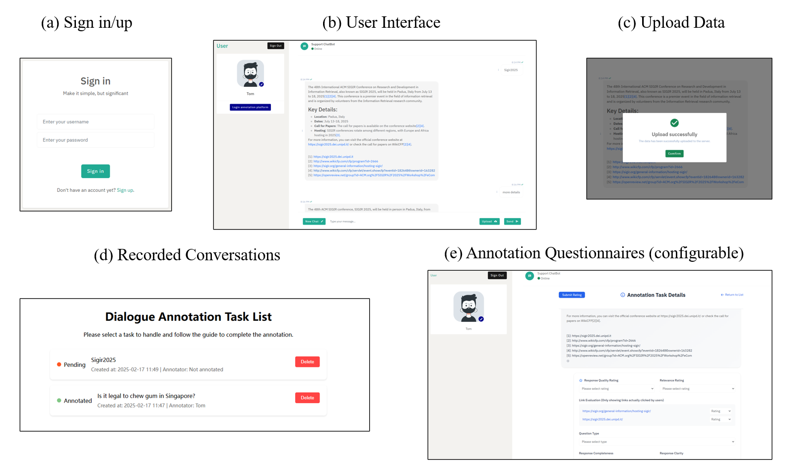

# GUS-Platform: A Flexible User Study Platform for Generative Information Retrieval

## Introduction
To advance the understanding of user behavior and experience with generative information retrieval (IR) systems, we present a comprehensive platform designed to collect user interactions and feedback in this emerging field. This platform consists of three key components: 1) a generative IR system that supports both API-based and customized retrieval-augmented generation (RAG) methods, 2) a user interface that logs various user behaviors, such as prompts, clicks, mouse movements, and scrolling, and 3) an annotation website where users can provide valuable feedback. By providing detailed logs of user actions and facilitating feedback collection, this platform aims to streamline data gathering for studies on user interaction with generative IR systems, thereby fostering future research into how users engage with and evaluate these novel systems.



## Demo Video
You can check out our demo video here: [Watch on YouTube](https://www.youtube.com/watch?v=Zgj2gaDsmOU)

## How to run
1. Install FlashRAG and Django with pip:
   ```python
    pip install flashrag-dev --pre
    pip install Django
    pip install django-cors-headers
    pip install djangorestframework
   ```
2. Execute the following code to run the paltform:
   ```python
    python manage.py runserver <your-ip>:<your-port>
   ```
3. Once the server is running, open a web browser and visit `http://<your-ip>:<your-port>` to reach the login page.

   
## Main Interfaces

